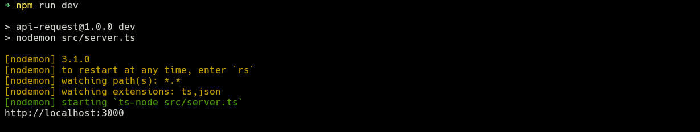

# Api Request

## About
Api-request created in NodeJS with TypeScript. This a api-request model where, makes requests to a database.

## Features
- CRUD
- Login with email and password

## Routes
- URL base: `http://localhost:3000`
- Users route: `http://localhost:3000/users`
- Login route: `http://localhost:3000/login`

## Requirements
- [NodeJS](https://nodejs.org/en) v18.20.2 or higher
- A database in MySQL with datas
- A tool to http request. For example [Insomnia](https://insomnia.rest/download) or the extension to Visual Studio Code [REST Client](https://marketplace.visualstudio.com/items?itemName=humao.rest-client)

## Usage

1- Clone this respository with the `git clone https://github.com/LeoSantosp2/api-request.git`.

2- Install the package with the command `npm i` or `npm install`. You can use better `yarn`.

3- Configure the database credencials in the file `.env` with the variables:
```
DATABASE=database_name
DATABASE_HOST=database_host
DATABASE_PORT=database_port
DATABASE_USERNAME=database_username
DATABASE_PASSWORD=database_password
```

Atention: The ambient variables it has to be equals the example above.

4- execute the command `npm run dev`.

Success image:
